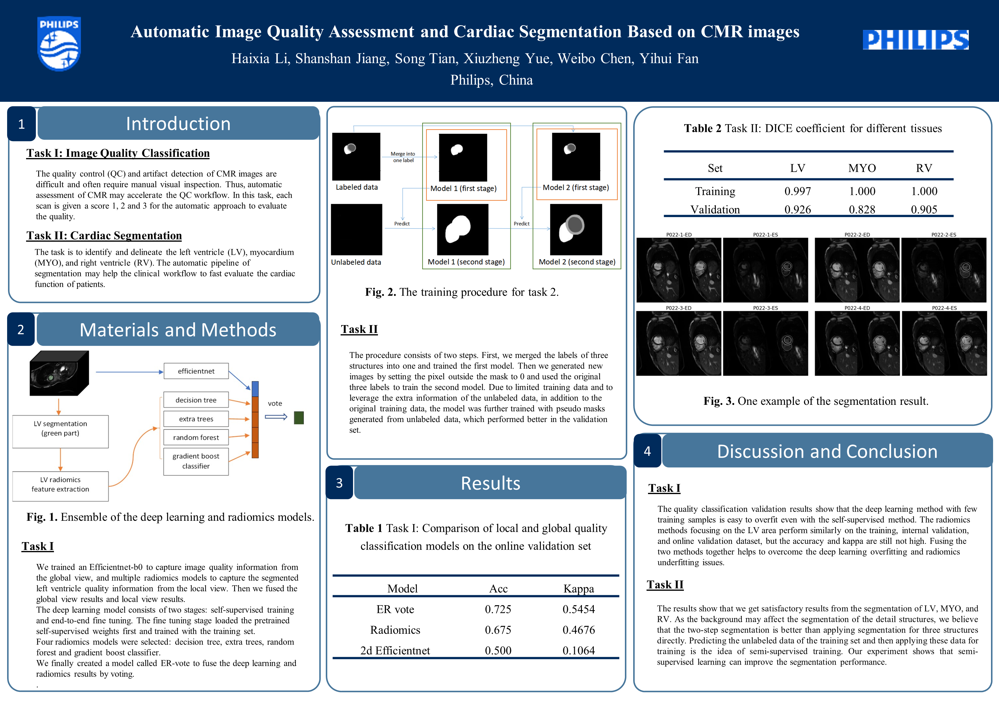

## Introduction
This is the official code submitted to the CMRxMotion challenge by Team Philips_CTS. 
It's also the Final Dockerfile submitted to MICCAI 2022 [CMRxMotion Challenge](http://cmr.miccai.cloud/)

<!-- arxiv Version with the GitHub code link in the paper:
[]()

Springer Version without GitHub code link in the paper:
[]() -->

## Datasets
CMRxMotion Dataset: [http://cmr.miccai.cloud/data/](http://cmr.miccai.cloud/data/)

## Methodology and Poster Overview
<!--  -->


## Usage
This repository has been made publicly available with the consent of Team Philips_CTS under the Apache 2.0 License.

## Citation
If this code is useful for your research, please consider citing:

```
@InProceedings{10.1007/978-3-031-23443-9_41,
author="Li, Haixia
and Jiang, Shanshan
and Tian, Song
and Yue, Xiuzheng
and Chen, Weibo
and Fan, Yihui",
editor="Camara, Oscar
and Puyol-Ant{\'o}n, Esther
and Qin, Chen
and Sermesant, Maxime
and Suinesiaputra, Avan
and Wang, Shuo
and Young, Alistair",
title="Automatic Image Quality Assessment and Cardiac Segmentation Based on CMR Images",
booktitle="Statistical Atlases and Computational Models of the Heart. Regular and CMRxMotion Challenge Papers",
year="2022",
publisher="Springer Nature Switzerland",
address="Cham",
pages="439--446",
abstract="This paper describes our methods for two tasks: automatic image quality assessment and cardiac segmentation based on cardiovascular magnetic resonance (CMR) images with respiration motion artifacts. For the quality assessment task, we developed a method fusing deep learning model results and radiomics model results. We trained an Efficientnet-b0 to capture image quality information from the global view. We trained multiple radiomics models to capture the segmented left ventricle quality information from the local view. Then we fused the global view results and local view results. We achieved an accuracy of 0.725 and kappa of 0.545 for the online validation set and got 2nd rank for the online test set with an accuracy of 0.7083 and kappa of 0.5493. For the segmentation task identifying the left ventricle blood pool (LV), myocardium (MYO), and right ventricle blood pool (RV), we used nnUNet as the backbone network and trained two cascaded models to predict the final three structures. The first model was trained by taking the three structures as one class, and the second was trained to segment each structure based on the first model's prediction. We also used the trained model to predict the data that have not been labeled in the training set due to low image quality and get their pseudo labels. Then we finally trained a new model with all available data, including unlabeled data with pseudo labels. Our online validation results for the cardiac segmentation task achieved top-1 rank in dice score of LV and top-10 rank in dice score of MYO, and RV blood pools in the challenge validation leaderboard. We achieved 5th rank on the online test set.",
isbn="978-3-031-23443-9"
}


```
